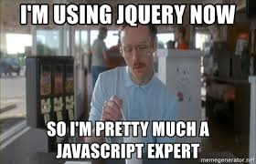

<div align="center">

# jQuery advanced



</div>

## Resources

Read or watch:

- [jQuery CDN](https://releases.jquery.com/)
- [jQuery API Documentation](https://api.jquery.com/)
- [Json server](https://github.com/typicode/json-server)

## Learning Objectives

At the end of this project, you are expected to be able to explain to anyone, ***without the help of Google***:

### General

    - Learn how to load jQuery from a CDN in a page
    - Learn the different ways to create DOM elements with jQuery
    - Learn how to modify elements
    - Learn how to add new elements to a page with different positions
    - Learn how to add a click handler on an element
    - Learn how to send GET, POST, DELETE or any type of AJAX query with jQuery
    - Learn how to create a pagination

## Requirements

### General

    - Allowed editors: vi, vim, emacs, Visual Studio Code
    - All your files should end with a new line
    - A README.md file, at the root of the folder of the project, is mandatory

---

To ensure we start on the same foot, use this files as a base to start the tasks: [0.html](0.html), then it will be reused from the task 0 to 12 to make some adds and modifications.

|   Task     |           file          | Objective  |
|   :---:    |           :---:         |       :---:       |
|0. Setup your dev environment     | [0-index.html](0-index.html) | Set your file with jQuery |
|1. Creating a DOM element     | [1-index.html](1-index.html) | Create a function named "createTextElement" |
|2. Creating multiple DOM elements at once     | [2-index.html](2-index.html) |  |
|3. Chain DOM elements     | [3-index.html](3-index.html) |  |
|4. HTML function     | [4-index.html](4-index.html) |  |
|5. Click attribute and remove function     | [5-index.html](5-index.html) |  |
|6. Val, before, and prepend functions     | [6-index.html](6-index.html) |  |
|7. Query - Setup your dev environment     | [7-index.html](0-index.html) |   |
|8. Pagination     | [8-index.html](8-index.html) |   |
|9. Wrap/unwrap     | [9-index.html](9-index.html) |  |
|10. Another Get API    | [10-index.html](10-index.html) | Setup your dev environment with [db.json](db.json) |
|11. Post query    | [11-index.html](11-index.html) |  |
|12. Delete query    | [12-index.html](12-index.html) |  |


### Json Server 

From task 10 to 12 You need to use the [db.json](db.json) file and manage the Json server by following these different steps:


#### 1. Install nvm (if not installed)
```bash
curl -o- https://raw.githubusercontent.com/nvm-sh/nvm/v0.39.0/install.sh
```

#### 2. Activate nvm 
```bash
source ~/.nvm/nvm.sh
```
#### 3. Close and reopen the terminal

#### 4. Install Node.js version 18
```bash
nvm install 18
```

#### 5. Use Node.js version 18
```bash
nvm use 18
```

#### 6. Install JSON Server locally in your project
```bash
npm install json-server
```

#### 7.  Start JSON Server using npx
```bash
npx json-server --watch db.json
```
